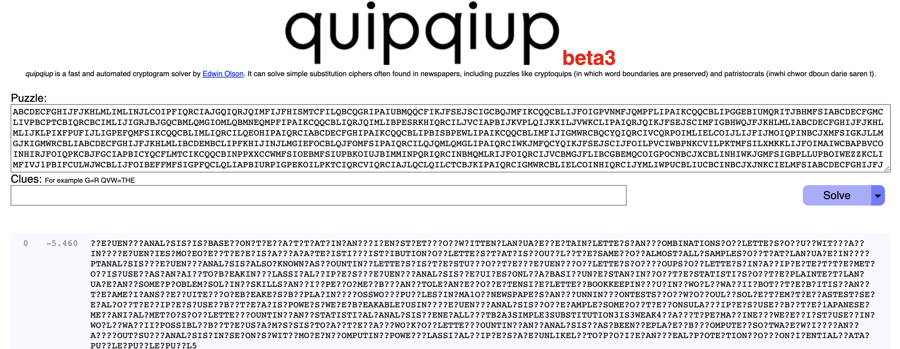

In this Crypto challenge, we are given 2 files, a python script and a text file. Interestingly, the prompt of this challenge mention the following:
> One of these tools is quipqiup, an automated tool for frequency analysis and breaking substitution ciphers. 

### source.py 
```python
from os import urandom
from Crypto.Cipher import AES
from secret import MESSAGE

assert all([x.isupper() or x in '{_} ' for x in MESSAGE])


class Cipher:

    def __init__(self):
        self.salt = urandom(15)
        key = urandom(16)
        self.cipher = AES.new(key, AES.MODE_ECB)

    def encrypt(self, message):
        return [self.cipher.encrypt(c.encode() + self.salt) for c in message]


def main():
    cipher = Cipher()
    encrypted = cipher.encrypt(MESSAGE)
    encrypted = "\n".join([c.hex() for c in encrypted])

    with open("output.txt", 'w+') as f:
        f.write(encrypted)


if __name__ == "__main__":
    main()
```

### output.txt (1479 lines)
```
dfc8a2232dc2487a5455bda9fa2d45a1
305d4649e3cb097fb094f8f45abbf0dc
c87a7eb9283e59571ad0cb0c89a74379
60e8373bfb2124aea832f87809fca596
d178fac67ec4e9d2724fed6c7b50cd26
c87a7eb9283e59571ad0cb0c89a74379
34ece5ff054feccc5dabe9ae90438f9d
457165130940ceac01160ac0ff924d86
5d7185a6823ab4fc73f3ea33669a7bae
...
```

## Analysis

We see that the algorithm used for encryption is AES mode ECB, encryption will happen by 16 bytes block, and we also know that, if we run the script once, with the same key, the same block of byte will generate the same encrypted output.

We see that the message is all upper case, and contains only uppercase letters, spaces, curly braces and underscores, through the assertion.

Encryption use a salt of 15 bytes, AES ECB encrypt by group of 16 bytes, and we see that message is split by characters, so each byte/character is encrypted separately, and all with the same salt. If the message was XYX, we would have the following:

```
SALT = SALTSALTSALTSAL

aes_encrypt( X + SALTSALTSALTSAL )
aes_encrypt( Y + SALTSALTSALTSAL )
aes_encrypt( X + SALTSALTSALTSAL )
```
If we think in reverse, every line of the output file represents one character of the message and if 2 lines are identical, they are the same character in the original message. Let's use a quick script to replace every line by one letter, through subsition, from a given alphabet, first let's look at how many different line we have in the file:

```
» sort -u output.txt | wc -l
30
```

Message is composed from only 30 differents charactets, let's use a simple alphabet and substitute:

```
file1 = open('output.txt', 'r')
Lines = file1.readlines()

index=0
alpahabet = "ABCDEFGHIJKLMNOPQRSTUVWXYZ1234567890";
dic = {}
message = ""
for l in Lines:
    if l not in dic:
        dic[l] = alpahabet[index]
        index = index + 1
    message = message + dic[l]
print(message)
```

```
python solve.py
ABCDECFGHIJFJKHLMLIMLINJLCOIPFIQRCIAJGQIQRJQIMFIJFHISMTCFILQBCQGRIPAIUBMQQCFIKJFSEJSCIGCBQJMFIKCQQCBLIJFOIGPVNMFJQMPFLIPAIKCQQCBLIPGGEBIUMQRITJBHMFSIABCDECFGMCLIVPBCPTCBIQRCBCIMLIJIGRJBJGQCBMLQMGIOMLQBMNEQMPFIPAIKCQQCBLIQRJQIMLIBPESRKHIQRCILJVCIAPBIJKVPLQIJKKILJVWKCLIPAIQRJQIKJFSEJSCIMFIGBHWQJFJKHLMLIABCDECFGHIJFJKHLMLIJKLPIXFPUFIJLIGPEFQMFSIKCQQCBLIMLIQRCILQEOHIPAIQRCIABCDECFGHIPAIKCQQCBLIPBISBPEWLIPAIKCQQCBLIMFIJIGMWRCBQCYQIQRCIVCQRPOIMLIELCOIJLIJFIJMOIQPINBCJXMFSIGKJLLMGJKIGMWRCBLIABCDECFGHIJFJKHLMLIBCDEMBCLIPFKHIJINJLMGIEFOCBLQJFOMFSIPAIQRCILQJQMLQMGLIPAIQRCIWKJMFQCYQIKJFSEJSCIJFOILPVCIWBPNKCVILPKTMFSILXMKKLIJFOIMAIWCBAPBVCOINHIRJFOIQPKCBJFGCIAPBICYQCFLMTCIKCQQCBINPPXXCCWMFSIOEBMFSIUPBKOIUJBIMMINPQRIQRCINBMQMLRIJFOIQRCIJVCBMGJFLIBCGBEMQCOIGPOCNBCJXCBLINHIWKJGMFSIGBPLLUPBOIWEZZKCLIMFIVJ1PBIFCULWJWCBLIJFOIBEFFMFSIGPFQCLQLIAPBIURPIGPEKOILPKTCIQRCVIQRCIAJLQCLQILCTCBJKIPAIQRCIGMWRCBLIELCOINHIQRCIJYMLIWPUCBLIUCBCINBCJXJNKCIELMFSIABCDECFGHIJFJKHLMLIAPBICYJVWKCILPVCIPAIQRCIGPFLEKJBIGMWRCBLIELCOINHIQRCI1JWJFCLCIVCGRJFMGJKIVCQRPOLIPAIKCQQCBIGPEFQMFSIJFOILQJQMLQMGJKIJFJKHLMLISCFCBJKKHIRQN2J3LMVWKC3LENLQMQEQMPF3ML3UCJX4IGJBOIQHWCIVJGRMFCBHIUCBCIAMBLQIELCOIMFIUPBKOIUJBIMMIWPLLMNKHINHIQRCIELIJBVHLILMLIQPOJHIQRCIRJBOIUPBXIPAIKCQQCBIGPEFQMFSIJFOIJFJKHLMLIRJLINCCFIBCWKJGCOINHIGPVWEQCBILPAQUJBCIURMGRIGJFIGJBBHIPEQILEGRIJFJKHLMLIMFILCGPFOLIUMQRIVPOCBFIGPVWEQMFSIWPUCBIGKJLLMGJKIGMWRCBLIJBCIEFKMXCKHIQPIWBPTMOCIJFHIBCJKIWBPQCGQMPFIAPBIGPFAMOCFQMJKIOJQJIWEZZKCIWEZZKCIWEZZK5
```

Remember the mention of quipqiup, [quipqiup](https://quipqiup.com/) is an algorithm cryptogram solver, used to solve subsitution algorithms, one of the parameters being frequency of letter in a language. Let's [use quipqiup.com] on our message:



After some fiddling (for instance we see A is F, I is a space, we can improve that message to the following:

```
FREQUENCY ANALYSIS IS BASED ON THE FACT THAT IN ANY GIVEN STRETCH OF WRITTEN LANGUAGE CERTAIN LETTERS AND COMBINATIONS OF LETTERS OCCUR WITH VARYING FREQUENCIES MOREOVER THERE IS A CHARACTERISTIC DISTRIBUTION OF LETTERS THAT IS ROUGHLY THE SAME FOR ALMOST ALL SAMPLES OF THAT LANGUAGE IN CRYPTANALYSIS FREQUENCY ANALYSIS ALSO KNOWN AS COUNTING LETTERS IS THE STUDY OF THE FREQUENCY OF LETTERS OR GROUPS OF LETTERS IN A CIPHERTEXT THE METHOD IS USED AS AN AID TO BREAKING CLASSICAL CIPHERS FREQUENCY ANALYSIS REQUIRES ONLY A BASIC UNDERSTANDING OF THE STATISTICS OF THE PLAINTEXT LANGUAGE AND SOME PROBLEM SOLVING SKILLS AND IF PERFORMED BY HAND TOLERANCE FOR EXTENSIVE LETTER BOOKKEEPING DURING WORLD WAR II BOTH THE BRITISH AND THE AMERICANS RECRUITED CODEBREAKERS BY PLACING CROSSWORD PU??LES IN MA1OR NEWSPAPERS AND RUNNING CONTESTS FOR WHO COULD SOLVE THEM THE FASTEST SEVERAL OF THE CIPHERS USED BY THE AXIS POWERS WERE BREAKABLE USING FREQUENCY ANALYSIS FOR EXAMPLE SOME OF THE CONSULAR CIPHERS USED BY THE 1APANESE MECHANICAL METHODS OF LETTER COUNTING AND STATISTICAL ANALYSIS GENERALLY HTB2A3SIMPLE3SUBSTITUTION3IS3WEAK4 CARD TYPE MACHINERY WERE FIRST USED IN WORLD WAR II POSSIBLY BY THE US ARMYS SIS TODAY THE HARD WORK OF LETTER COUNTING AND ANALYSIS HAS BEEN REPLACED BY COMPUTER SOFTWARE WHICH CAN CARRY OUT SUCH ANALYSIS IN SECONDS WITH MODERN COMPUTING POWER CLASSICAL CIPHERS ARE UNLIKELY TO PROVIDE ANY REAL PROTECTION FOR CONFIDENTIAL DATA PU??LE PU??LE PU??L5
```

We see a suspicious: HTB2A3SIMPLE3SUBSTITUTION3IS3WEAK4, if we assume 2 is { , 3 is _ and 4 is }, we have our flag: `HTB{A_SIMPLE_SUBSTITUTION_IS_WEAK}`
