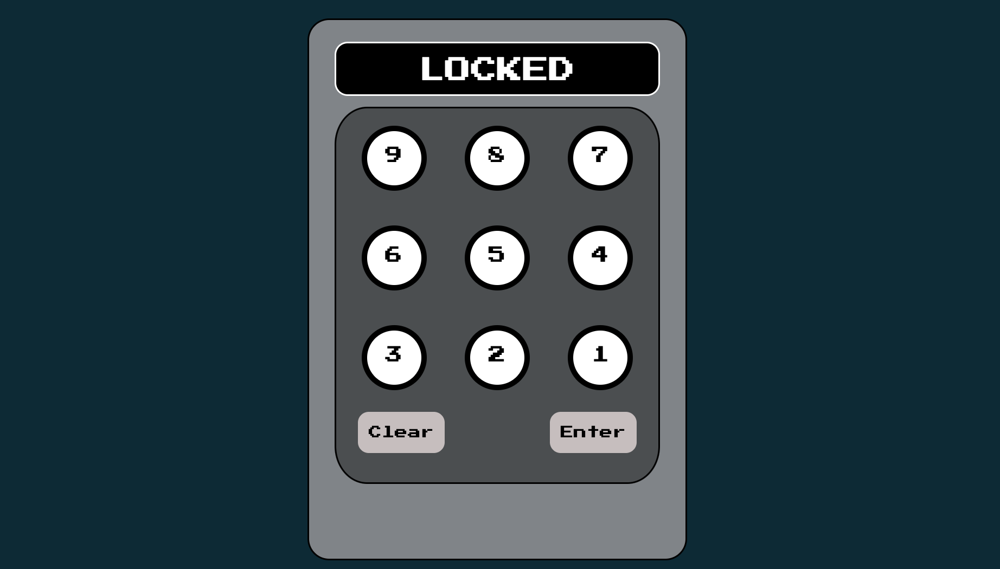
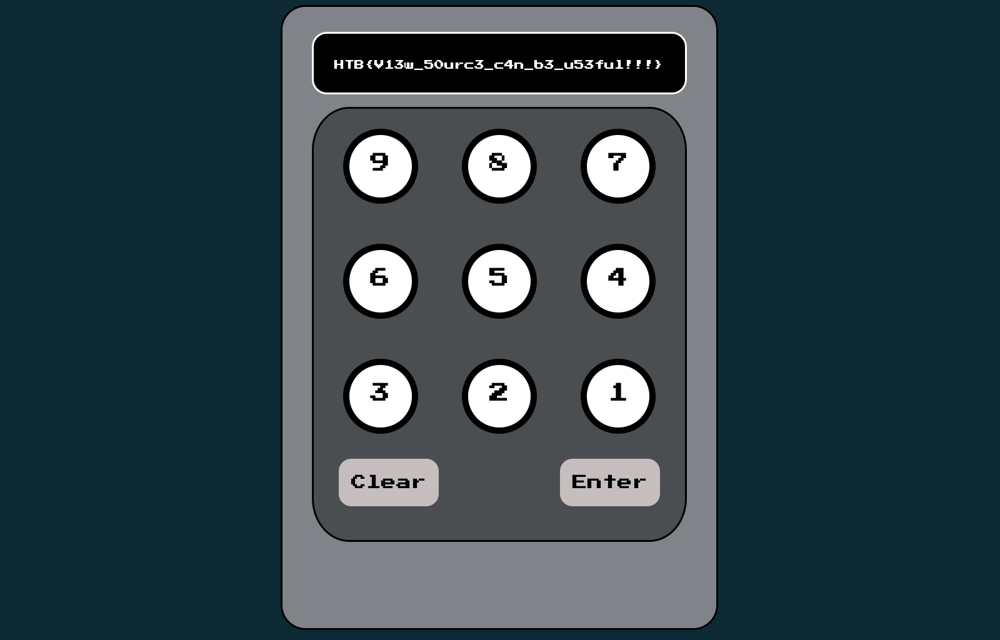

In this challenge, we can start a docker image, but no source is provided, the website that is shown represent a combination lock.



As we do not have much to start from, let's look at the source code of the page, which happen to contains the following:

```html
<body>
	<script>
		window.CONFIG = window.CONFIG || {
			buildNumber: "v20190816",
			debug: false,
			modelName: "Valencia",
			correctPin: "8291",
		}
	</script>
```

Using the given PIN, the lock can be open


