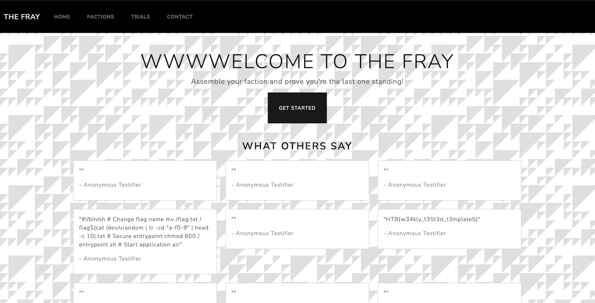

This challenge exposes a website on a port and a GRPC server on a different port. This tech stack was refreshing for a CTF, as the server was in Golang, which i did not see a lot in CTF.

The Website allows users to submit a testimonial, with 2 fields, content and name. When a user is adding a new testimonial on the website, a handler receives the name and content, and will call the GRPC service, that will in turn write the content of the testimonial to the file "public/testimonials/{customer}"

Uploading a testimonial creates a file, and we control both the name and the content of this file, which is quite promising.

The handler for creating testimonial does however sanitize the file name before calling the GRPC service:

```Golang
func (c *Client) SendTestimonial(customer, testimonial string) error {
	ctx := context.Background()
	// Filter bad characters.
	for _, char := range []string{"/", "\\", ":", "*", "?", "\"", "<", ">", "|", "."} {
		customer = strings.ReplaceAll(customer, char, "")
	}

	_, err := c.SubmitTestimonial(ctx, &pb.TestimonialSubmission{Customer: customer, Testimonial: testimonial})
	return err
}
```

This mean we can't create directly an arbitrary file, however, the GRPC server is also accessible, so directly calling the GRPC server can allow us to create a file on the server, which we can test and validate using `grpc_cli` . The GRPC server does not implement reflection capabilities, but within the code -- that we can download -- we have the protofile, the following command:

```bash
grpc_cli call localhost:50045 SubmitTestimonial "customer:'test' testimonial:'test'" --protofiles=ptypes.protofile
```
creates a file test, with the content test in the public/testimonials folder.

*At this point, we can rewrite the code of the applciation, add a new handler that read all the file at the root, and call it a day, right?*

Wait, no so fast, the website is in Golang, which is compiled, luckily enough, the website is with the code source, but still, changing a source file will not do anything to the executable, we would need to recompile the binary.


Luckily for us, we have a development version of the website, and it's running using [air](https://github.com/cosmtrek/air), a live reload utility for golang developemnt. Checking the configuration of air, in the .air.toml file, we see the following line:

```
include_ext = ["tpl", "tmpl", "templ", "html"]
```

So air will recompile the binary, if any file with those extension is modified.

Another interesting fact, this website uses [templ](https://github.com/a-h/templ) to generate HTML content. templ is a HTML templating language for Go, it uses language that marries Golang and HTML and generates on build a go file, with a function that will return html content. It also allows to run go code as part of the generated result file. 

Looking at the templ file, we see that it's getting the testimonial to display on the home page from the following function:

```golang
func GetTestimonials() []string {
	fsys := os.DirFS("public/testimonials")	
	files, err := fs.ReadDir(fsys, ".")		
	if err != nil {
		return []string{fmt.Sprintf("Error reading testimonials: %v", err)}
	}
	var res []string
	for _, file := range files {
		fileContent, _ := fs.ReadFile(fsys, file.Name())
		res = append(res, string(fileContent))		
	}
	return res
}
```

Exploit:
----

We want the website to load the content of the root directory where the flag is, to load the testimonials instead of the content of folder `public/testimonials`.

To achieve this, we can use the GRPC to rewrite the template of the home page, as it has a templ extension, the website will be rebuilt and the new code will be executed.

Let's make a copy of the template for the home page and replace the function `GetTestimonials` by the following;

```golang
func GetTestimonials() []string {
	fsys := os.DirFS("/")	
	files, err := fs.ReadDir(fsys, ".")		
	if err != nil {
		return []string{fmt.Sprintf("Error reading testimonials: %v", err)}
	}
	var res []string
	for _, file := range files {
		fileContent, _ := fs.ReadFile(fsys, file.Name())
		res = append(res, string(fileContent))		
	}
	return res
}
```

Call the GPRC service to create a testimonial with name `../../view/home/index.templ`, for the content, let's use the copy of the template we just described, then website is then rebuilt and display the content of the file at the root of the server.



And so we get the flag.
