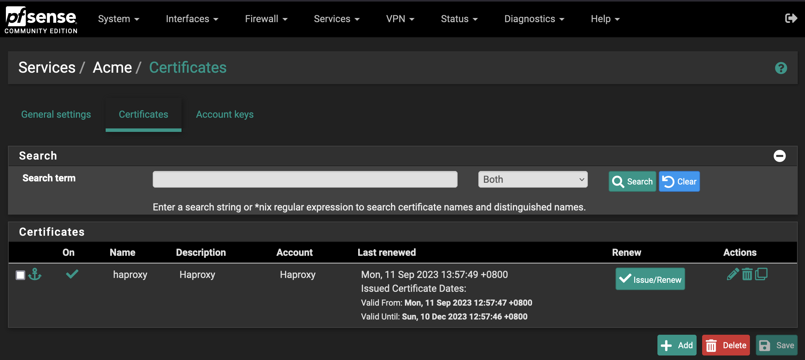

I'm operating my home network using pfSense, and wanted to try to install HAProxy on pfSense, to replace my old setup with a NAT rule of WAN port 443 to my home server with HAProxy running on it. pfSense has a package for HAProxy, which also should handle auto-renewal of certifiacte with letsencrypt, we should simplify my home setup.

After connecting to my pfSense, I installed the package for HAProxy, and was ready to test it. First thing first, i need a DNS and a certificate. My domain name is managed through Gandi, and pfSense is using Gandi API to handle dynamic DNS for my home IP.

However, when trying to renew my certificate for HAProxy on pfSense, i was facing a 403 error on the Gandi API.

Gandi did change their authentication mechanism, they did deprecate API Key in favor of Personal Access Token, sent through Authorization header as a bearer token:

```
Authorization: Bearer my_token
```

After some debugging on the unauthorized error from Gandi, the culprit was the following file : `/usr/local/pkg/acme/dnsapi/dns_gandi_livedns.sh`

This script is setting the API Key for Gandi in a wrong header:

```sh
_gandi_livedns_rest() {
  m=$1
  ep="$2"
  data="$3"
  _debug "$ep"

  export _H1="Content-Type: application/json"
  export _H2="X-Api-Key: $GANDI_LIVEDNS_KEY"

  if [ "$m" = "GET" ]; then
    response="$(_get "$GANDI_LIVEDNS_API/$ep")"
  else
    _debug data "$data"
    response="$(_post "$data" "$GANDI_LIVEDNS_API/$ep" "" "$m")"
  fi

  if [ "$?" != "0" ]; then
    _err "error $ep"
    return 1
  fi
  _debug2 response "$response"
  return 0
}
```

Replacing line
```sh
  export _H2="X-Api-Key: $GANDI_LIVEDNS_KEY"
```
with
```sh
  export _H2="Authorization: Bearer $GANDI_LIVEDNS_KEY"
```
Did solve my issue, certificates are now being renewed succesfully.


